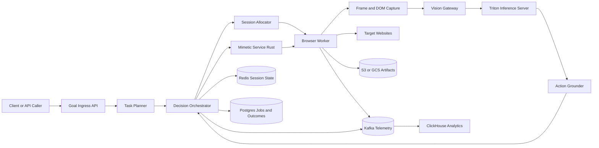

# Diagram 1: End-to-End System Architecture

## What this shows

- Full control path from user goal to browser action.
- Vision feedback loop returning grounded targets.
- State, telemetry, and artifact persistence paths.
