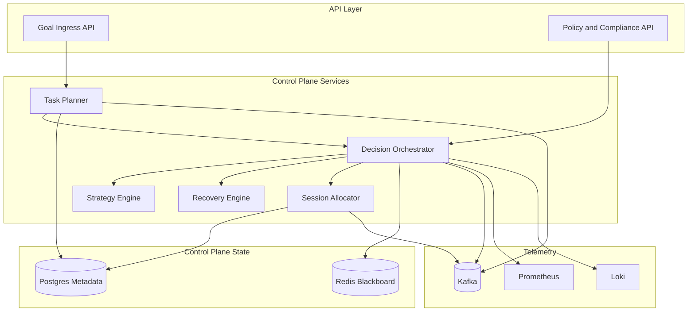

# Diagram 2: Control Plane Architecture

## What this shows

- Planning, orchestration, strategy, and recovery modules.
- Control state split between Redis and Postgres.
- Observability and event streaming integration.
