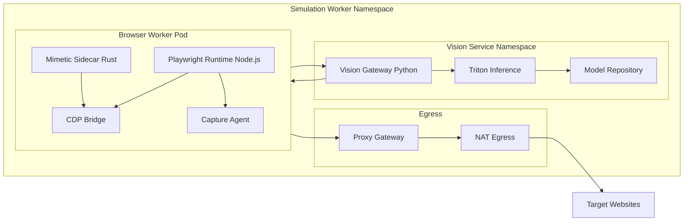

# Diagram 3: Simulation Plane Architecture

## What this shows

- Per-session pod composition for browser execution.
- Shared GPU inference services for visual reasoning.
- Controlled egress path for identity-aware outbound traffic.
