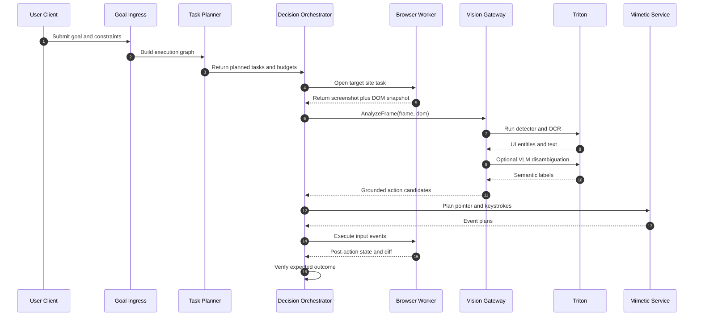

# Diagram 4: Goal to Coordinate Click Sequence

## What this shows

- Full Vision-to-Action loop with feedback verification.
- Conditional VLM invocation for ambiguous cases.
- Separation between planning and low-level input emission.
