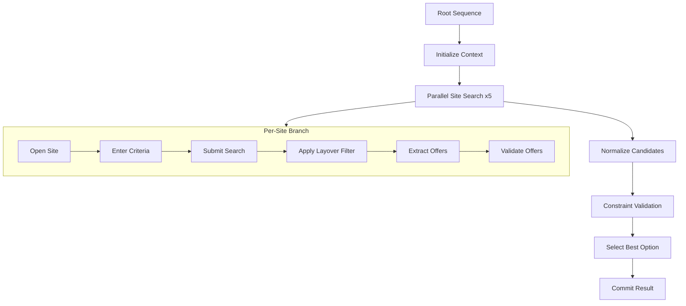
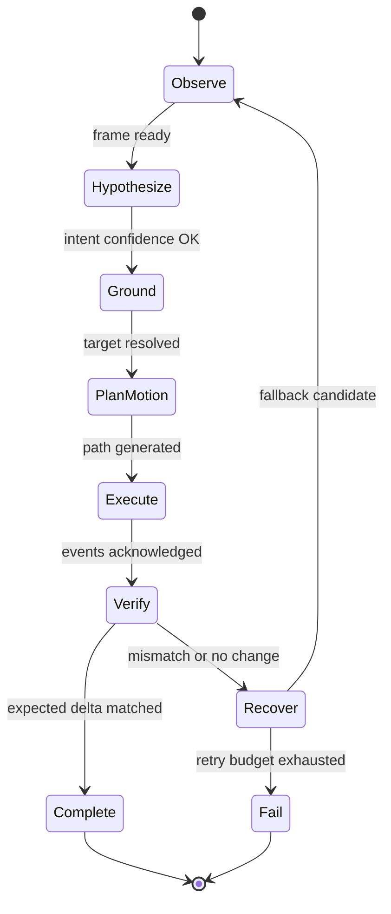

# Diagram 5: Decision Orchestrator Architecture

## 5.1 Behavior Tree (Task Level)

## 5.2 Action State Machine (Step Level)

## What this shows

- Hybrid BT plus HSM execution model.
- BT handles multi-site strategy.
- HSM handles deterministic action lifecycle.
