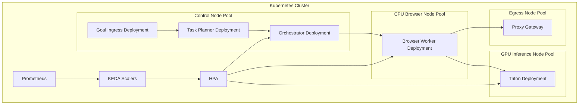

# Diagram 6: Kubernetes Deployment and Scaling Architecture

## What this shows

- Node pool separation by workload type.
- Autoscaling driven by queue and metrics signals.
- Inference and browser workers scaling independently.
