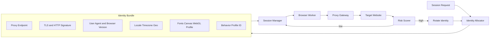

# Diagram 7: Session Identity and Proxy Architecture

## What this shows

- Identity is assigned as a coherent bundle, not random fields.
- Risk-scored feedback loop governs rotation.
- Sticky identity per session with controlled rotation triggers.
