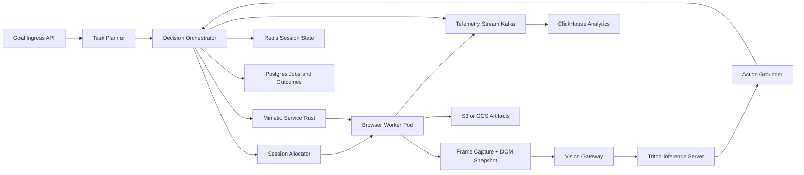

# HLD: System Overview

## 1) Problem and Goal

Project Mimic is a distributed execution engine that emulates realistic user behavior on modern web applications at very large scale.

Stage 1 goals:

- High-fidelity rendering of full web stacks.
- Vision-first action planning and coordinate grounding.
- Human-like pointer and keyboard interaction synthesis.
- Horizontal scale to 100k+ concurrent sessions using Kubernetes.

## 2) Logical Architecture

The platform is split into two runtime planes:

- Control Plane
  - Goal ingestion, planning, orchestration, policy, and scheduling.
- Simulation Plane
  - Browser execution, screenshot capture, vision inference, action emission.

## 3) Runtime Components

### 3.1 Goal Ingress Service (Python or Node.js)

- Accepts objective, constraints, timeout, and site scope.
- Validates request schema and assigns idempotency key.
- Produces job record in Postgres.

### 3.2 Task Planner (Python)

- Converts natural goal into structured execution graph.
- Builds per-site subtasks and success criteria.
- Sets budget tokens: time, retries, inference quota.

### 3.3 Decision Orchestrator (Python)

- Runs hybrid Behavior Tree + action-level State Machine.
- Coordinates perception, grounding, execution, and verification.
- Handles retries, fallbacks, and recovery policies.

### 3.4 Browser Worker (Node.js + Playwright)

- Launches browser contexts tied to identity bundles.
- Loads full page resources and executes interactions.
- Captures synchronized screenshot and DOM/layout snapshots.

### 3.5 Mimetic Sidecar (Rust)

- Generates non-linear pointer trajectories with realistic timing.
- Synthesizes variable cadence keystrokes.
- Emits low-level input events via Playwright/CDP bridge.

### 3.6 Vision Pipeline (Python + Triton)

- Runs detector, OCR, and VLM cascade.
- Produces UI entities, semantics, and confidence maps.
- Grounds entities to actionable coordinate + DOM node candidates.

## 4) Core Data Stores

- Redis
  - Active session blackboard and transient state.
- Postgres
  - Job definitions, plans, outcomes, and replay references.
- Object storage (S3/GCS)
  - Screenshots, traces, and optional interaction video.

## 5) Reliability Model

- Action idempotency keys prevent duplicate side effects.
- Step-level checkpoints enable fast crash recovery.
- Dead letter queues isolate failed sessions.
- Circuit breakers per site family prevent cascade failures.

## 6) Security Model

- gRPC over mTLS for all service-to-service traffic.
- Workload identity for short-lived credentials.
- Secret manager integration for proxy and account tokens.
- Strict network policies between control and simulation workloads.

## 7) Why This Architecture Fits Stage 1

- Separates expensive GPU inference from browser execution.
- Keeps low-latency input generation in Rust sidecar.
- Preserves fast orchestration iteration in Python/Node.js.
- Scales each bottleneck independently with queue signals.
