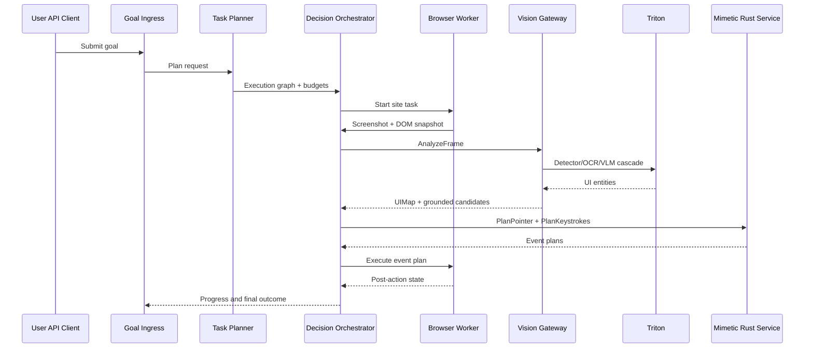

# HLD: Goal to Coordinate Click Data Flow

## 1) Input Contract

The execution request enters through Goal Ingress with a structured payload:

```json
{
  "job_id": "uuid",
  "goal": "Find cheapest flight with 1-hour layover across 5 sites",
  "constraints": {
    "layover_minutes": { "min": 50, "max": 70 },
    "currency": "USD",
    "max_runtime_seconds": 900
  },
  "sites": ["site_a", "site_b", "site_c", "site_d", "site_e"],
  "priority": "standard"
}
```

## 2) End-to-End Flow

1. Goal Ingress validates schema, attaches idempotency key, writes job record.
2. Task Planner generates a multi-site execution graph and budget tokens.
3. Session Allocator binds identity bundle and launches browser worker.
4. Browser Worker opens target site and loads full stack resources.
5. Orchestrator requests synchronized screenshot + DOM/layout snapshot.
6. Vision Gateway sends frame bundle to Triton inference cascade.
7. Detector and OCR identify UI regions and text candidates.
8. VLM is invoked only on ambiguous regions or semantic uncertainty.
9. Action Grounder maps visual entities to DOM node candidates.
10. Orchestrator selects intent and target using confidence and constraints.
11. Mimetic service generates pointer path and click timing profile.
12. Browser worker emits events through CDP and executes the action.
13. Orchestrator verifies outcome using visual diff, DOM changes, URL state.
14. On failure, recovery branch executes alternate candidate or strategy.
15. Loop repeats until success criteria are met or budget expires.

## 3) Key Runtime Artifacts

- FrameBundle
  - Screenshot bytes, viewport metadata, timestamp.
- DOMSnapshot
  - Node ids, roles, text, bounding boxes, z-order.
- UIMap
  - Visual entities with polygons, semantics, confidence.
- GroundedAction
  - Intent, coordinate, dom_node_id, fallback candidates.
- StepResult
  - Executed event id, verification status, new state digest.

## 4) Sequence Diagram



## 5) Decision Checkpoints

At each step, the orchestrator evaluates:

- Perception confidence
  - Is visual evidence above threshold?
- Grounding confidence
  - Do coordinate and DOM role/label align?
- Verification confidence
  - Did state change match expected delta?
- Risk score
  - Is site response indicating challenge or anomaly?

## 6) Latency Budget (Stage 1 Target)

- Screenshot + snapshot capture: 40-80 ms
- Detector + OCR: 80-140 ms
- VLM disambiguation (only when needed): 150-350 ms
- Grounding + decision: 20-60 ms
- Mimetic planning: 5-20 ms
- Input execution + verification: 80-250 ms

Typical p95 active-step latency target: 350-700 ms with cascade and caching.

## 7) Fallback Paths

- No target found
  - Expand ROI, invoke VLM tier, relax semantic strictness once.
- Wrong target clicked
  - Roll back with browser navigation and blacklist candidate.
- No page transition
  - Retry with alternative candidate and changed dwell pattern.
- Repeated challenge pages
  - Trigger identity rotation policy and warm-up flow.
